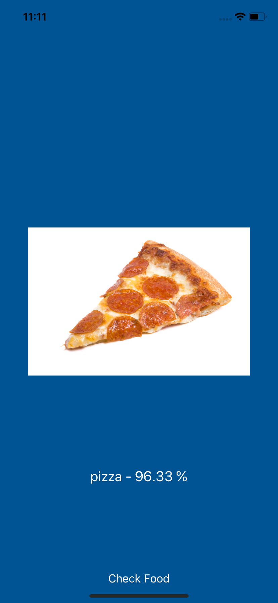
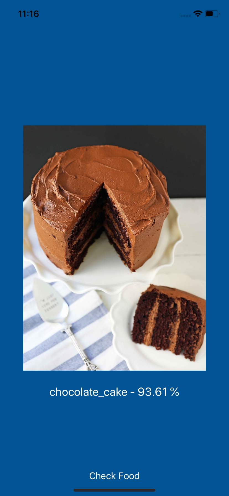

# Food Preictor
This app uses a machine learning model trained on Food101 dataset to predict food.

  
## Examples

If you want to find out more how this model works and on which data it was trained on, visit the Food101 Keras page on [Github](https://github.com/stratospark/food-101-keras)
